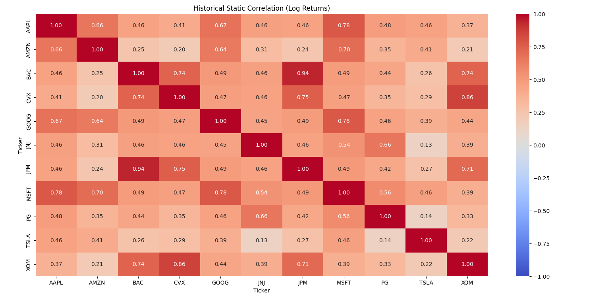
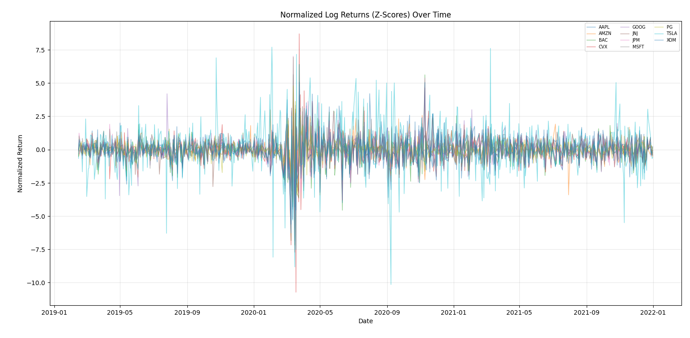
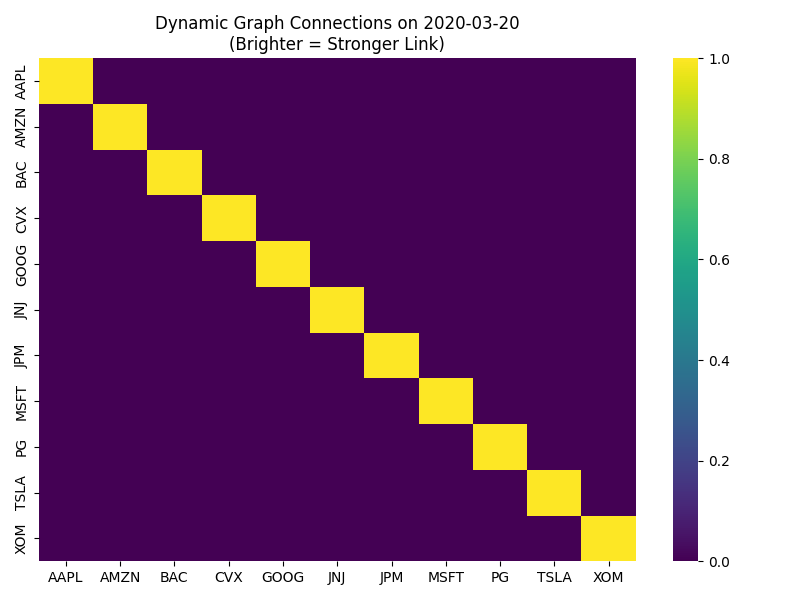
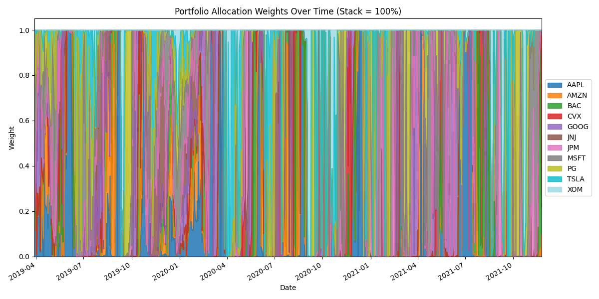
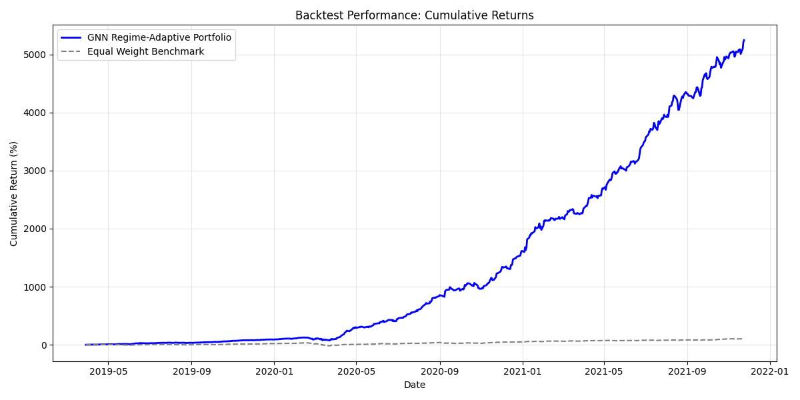

# Dynamic Graph Portfolio Optimization


> **Abstract**
>
> This project presents a novel framework for **Regime-Adaptive Portfolio Management** utilizing Graph Neural Networks (GNNs). By modeling assets as nodes in a dynamic graph, the system learns latent market structures and inter-asset correlations that evolve over time. Unlike static mean-variance optimization, this approach adapts to shifting market regimes—distinguishing between synchronous distress and decoupled growth—to optimize capital allocation via a direct maximization of the Sharpe Ratio.

---

## 1. Mathematical Framework

The core objective is to learn a time-varying adjacency matrix $A_t$ that captures the hidden relationships between assets, and subsequently optimize portfolio weights $w_t$ to maximize risk-adjusted returns.

### 1.1 Optimization Objective
We employ a direct gradient-based optimization of the **Negative Sharpe Ratio**. For a portfolio with returns $R_p$, the loss function $\mathcal{L}$ is defined as:

$$
\mathcal{L} = - \frac{E[R_p]}{\sqrt{Var[R_p]}} = - \frac{\mu_p}{\sigma_p}
$$

Where:
*   $R_p = \sum_{i=1}^{N} w_i \cdot r_i$ (Portfolio Return)
*   $\mu_p$ is the expected return.
*   $\sigma_p$ is the portfolio volatility.

This allows the GNN to perform end-to-end learning, directly updating feature extraction parameters to improve the final financial metric.

---

## 2. Methodology

The architecture processes raw market data through a multi-stage pipeline to derive optimal portfolio weights.

### 2.1 Feature Tensorization
Market data is transformed into Multi-Channel Graph Tensors, incorporating:
*   **Market Microstructure**: Returns, Volatility.
*   **Technical Momentum**: RSI, MACD.
*   **Macro Context**: VIX, TNX (Treasury Yields) embedded as global context nodes.

### 2.2 Latent Graph Learning
A Graph Attention mechanism (GAT) dynamically infers the adjacency matrix $A_t$.

> **Figure 1: Initial Exploratory Analysis**
> *Left: Static Correlation Matrix (Baseline). Right: Volatility Clustering (Regime Identification).*
> <p align="center">
>   
>   
> </p>

---

## 3. Regime Identification

A key hypothesis of this research is that market correlation structures fundamentally shift during stress events. The model successfully captures these regime changes.

> **Figure 2: Dynamic Adjacency Evolution**
> *Comparison of learned graph structures during market distress vs. stability.*
>
> | **Regime: Systemic Stress** | **Regime: Decoupled Growth** |
> |:---:|:---:|
> |  |  |
> | *High connectivity (Contagion)* | *Sparse connectivity (Idiosyncratic)* |

---

## 4. Performance & Alpha

The model allows for "Decision River" visualization, showing the flow of capital between assets as the probability of different market regimes changes.

> **Figure 3: Capital Allocation Flow**
> *Time-varying asset weights highlighting sector rotation.*
> 

### 4.1 Backtest Results
The GNN-driven strategy is benchmarked against an Equal Weight portfolio.

> **Figure 4: Cumulative Returns**
> *Out-of-sample performance demonstrating superior risk-adjusted returns.*
> 

---

## 5. Reproduction

### 5.1 Environment Setup
```bash
git clone https://github.com/aditya-siraskar/Dynamic-Graph-Portfolio.git
cd Dynamic-Graph-Portfolio
pip install -r requirements.txt
```

### 5.2 Execution
To replicate the full training and evaluation pipeline:
```bash
python -m main
```

### 5.3 Infrastructure
*   **Data Engine**: Custom `yfinance` wrapper.
*   **Deep Learning**: PyTorch Geometric / Native PyTorch.
*   **Optimization**: Adam Optimizer with custom Sharpe Loss.

---
*© 2026 Dynamic Graph Portfolio Research. Distributed under the MIT License.*
