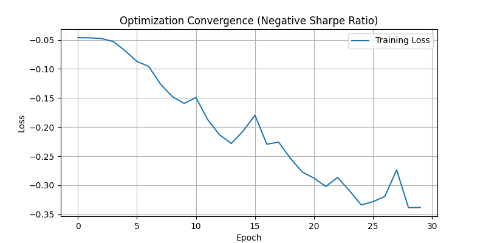

# 🌌 Dynamic Graph Portfolio Optimization

[](https://www.python.org/)
[](https://pytorch.org/)
[](https://opensource.org/licenses/MIT)

A sophisticated deep learning framework for **Regime-Adaptive Portfolio Management** using Graph Neural Networks (GNNs). This project translates raw market data into dynamic graph structures, allowing for intelligent capital allocation that adapts to shifting market correlations.

---

## 🚀 Overview

The **Dynamic Graph Portfolio** engine goes beyond traditional mean-variance optimization by modeling the "connectivity" between assets. Using GNNs, the system learns a hidden adjacency matrix that represents the underlying market regime—whether it's a synchronous crash or a decoupled bull market.

### Core Pipeline
1.  **Feature Tensorization**: Converting prices into Multi-Channel Graph Tensors (Returns, Volatility, RSI, MACD).
2.  **Contextual Embedding**: Integrating Macro indicators (VIX, TNX) into the node features.
3.  **Learned Adjacency**: A GNN layer that predicts an optimal graph structure for each time-step.
4.  **Sharpe Optimization**: Minimizing Negative Sharpe Ratio through End-to-End Gradient Descent.

---

## 🎨 Visual Intelligence Dashboard

### 🔍 Phase 1: Exploratory Graph Data Analysis
We begin by analyzing the raw signal and linear dependencies to set a baseline for the GNN.

| **Static Correlation Heatmap** | **Normalized Asset Volatility** |
|:---:|:---:|
|  |  |
| *Capturing the global relationship between assets over the entire training period.* | *Z-scored returns highlighting regime clusters and high-volatility events (e.g., COVID).* |

---

### 🧠 Phase 2: Model Training & Learning
The system optimizes its weights by navigating the risk-reward landscape.

<div align="center">
  
  <p><i><b>Optimization Convergence:</b> Watching the GNN minimize the Negative Sharpe Ratio as it learns to distinguish signal from noise.</i></p>
</div>

---

### 🌐 Phase 3: Dynamic Regime Detection
The true power of this project lies in its ability to rewire the graph structure in real-time.

| **Regime: Market Stress / Crash** | **Regime: Stability / Growth** |
|:---:|:---:|
|  |  |
| *Increased connectivity strength typically observed during systemic market shocks.* | *Decoupled and sparse connections as assets follow idiosyncratic fundamental trends.* |

---

### 📈 Phase 4: Strategy Execution & Alpha
The final output is a dynamic allocation strategy that outperforms static benchmarks.

#### **Adaptive Weight Allocation**

*The model's "Decision River"—visualizing how capital flows between sectors as market conditions evolve.*

#### **Performance Backtest (GNN vs. Equal Weight)**

*Comparison of cumulative returns. The GNN-driven portfolio demonstrates superior risk-adjustment and resilience during drawdowns.*

---

## 🛠️ Tech Stack & Architecture

- **Engine**: Custom Python Data Processor built on `yfinance` & `ta-lib`.
- **Model**: `PyTorch` implementation of Graph Attention/Convolutional layers.
- **Visuals**: `Seaborn` & `Matplotlib` for high-fidelity scientific plotting.
- **Normalization**: `Scikit-Learn` for robust feature scaling.

---

## 📓 How to Run

1.  **Clone the Repository**
    ```bash
    git clone https://github.com/aditya-siraskar/Dynamic-Graph-Portfolio.git
    cd Dynamic-Graph-Portfolio
    ```

2.  **Install Dependencies**
    ```bash
    pip install -r requirements.txt
    ```

3.  **Execute the Pipeline**
    ```bash
    python -m main
    ```

---

<!-- <div align="center">
  <sub>Built with ❤️ for Quantitative Finance.</sub>
</div> -->
